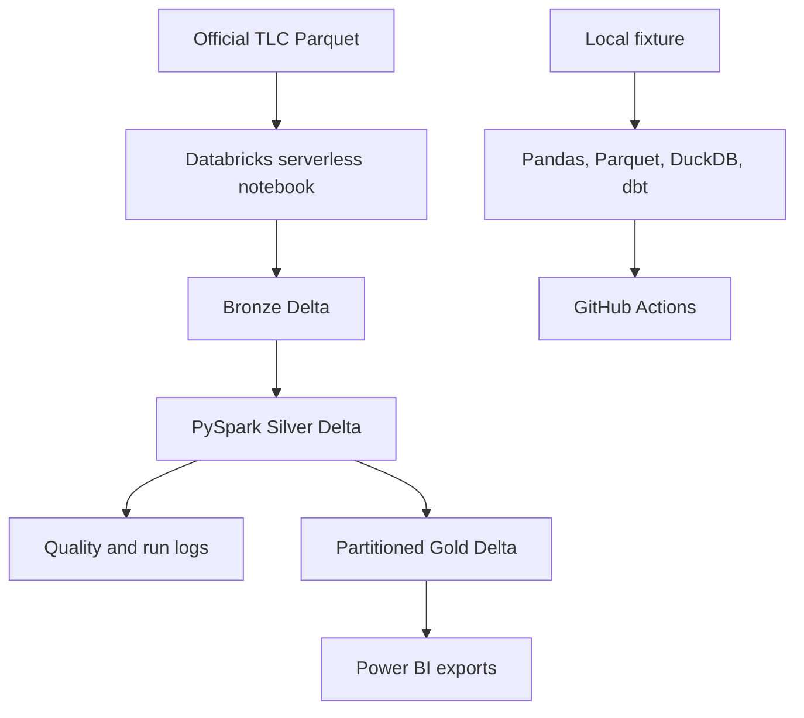

# Urban Mobility Analytics Engineering Platform

[](https://github.com/RishiRatnakarData/urban-mobility-analytics-engineering/actions/workflows/ci.yml)

Mobility operations teams need daily zone metrics they can trust after duplicate, invalid, rerun,
and late-arriving records enter the pipeline. This project implements a testable Bronze/Silver/Gold
contract locally and provides a Databricks PySpark/Delta implementation for authenticated execution.

> **Portfolio status:** the local Python and dbt contract is validated. The Databricks notebook is
> implementation-ready, but its cloud claims remain pending until the author completes
> [`docs/databricks_build.md`](docs/databricks_build.md) and records real run evidence.

## Current verified result

Refactor validation performed on September 10, 2026:

| Check | Verified result |
|---|---|
| Python transformation tests | 3/3 passed, including a late-arrival/upsert case |
| Sample Bronze / Silver / Gold rows | 12 / 12 / 12 |
| Local persisted quality checks | 6/6 passed |
| dbt DuckDB build | 2 models and 8 tests passed; 10/10 nodes |
| Environment | Python 3.12.10, dbt Core 1.12.4, dbt-duckdb 1.9.4 |

The committed fixture is intentionally tiny. These results verify behavior and reproducibility, not
real-world traffic volume or Databricks execution.

## What the project demonstrates

- A raw-to-curated medallion design with explicit grain and ownership at every layer.
- Schema validation, invalid-row filtering, deterministic keys, and duplicate protection.
- Persisted data-quality and pipeline-run evidence rather than console-only assertions.
- Delta MERGE for repeatable Bronze/Silver ingestion in the Databricks notebook.
- Partition-scoped Gold refreshes for late-arriving historical trips.
- dbt staging and an incremental daily-zone mart with a 62-day lookback and tested grain.
- Cloud-independent CI for Python, notebook syntax, the sample pipeline, and dbt.
- A documented Power BI Desktop semantic model based on small curated exports.

## Architecture



See [`docs/architecture.md`](docs/architecture.md) for layer grains, design decisions, and the
separation between local and cloud evidence.

## Reproduce the local contract

### Windows PowerShell

```powershell
py -3.12 -m venv .venv
.\.venv\Scripts\Activate.ps1
python -m pip install --upgrade pip
pip install -r requirements.txt
python -m pytest -q
python -m src.pipeline --sample
dbt build --profiles-dir .
```

### macOS or Linux

```bash
python3.12 -m venv .venv
source .venv/bin/activate
python -m pip install --upgrade pip
pip install -r requirements.txt
python -m pytest -q
python -m src.pipeline --sample
dbt build --profiles-dir .
```

The sample command persists Bronze, Silver, and Gold Parquet outputs, six quality results, and a JSON
run summary. Generated data and artifacts are ignored by Git.

## Execute on Databricks

Follow the [Databricks Free Edition checklist](docs/databricks_build.md). It covers:

1. An official NYC TLC monthly Parquet source.
2. Notebook import and managed-volume upload.
3. Five Delta tables and eight cloud quality checks.
4. Same-file rerun/idempotency validation.
5. A controlled missing-path failure and successful recovery.
6. A January-after-February late-arrival demonstration.
7. Curated CSV exports for Power BI Desktop.

Databricks Free Edition is sufficient for this portfolio execution; an Azure subscription is not
part of this repository's runtime.

## Claims ledger

Replace only bracketed fields with observed evidence from your own run.

| Claim | Evidence |
|---|---|
| Local Python tests | `3/3 passed` |
| Local sample rows | `Bronze 12; Silver 12; Gold 12` |
| Local quality checks | `6/6 passed` |
| Local dbt result | `2 models + 8 tests; 10/10 nodes` |
| Databricks run date | `[UTC date]` |
| Official source | `[TLC URL; 2025-02 and optional 2025-01; file sizes]` |
| Databricks business rows | `[Bronze; Silver; Gold]` |
| Databricks quality checks | `[passed / 8]` |
| Pipeline duration | `[seconds]` |
| Idempotent rerun | `[before/after counts and duplicate-key results]` |
| Controlled recovery | `[missing-path failure and repaired run]` |
| Late-arriving data | `[January-after-February result and refreshed partitions]` |
| Power BI | `[validated totals and screenshot path]` |
| GitHub Actions | `[successful run URL]` |

## Repository map

```text
databricks/          importable PySpark/Delta source notebook
src/                 local medallion and late-arrival contract
models/              dbt staging and incremental serving mart
tests/               transformation, late-arrival, and dbt-grain tests
docs/                architecture, execution, Power BI, and interview guidance
data/sample/         small committed fixture for deterministic CI
.github/workflows/   lint, tests, sample execution, and dbt build
```

## Evidence boundaries and limitations

- The sample fixture is synthetic-style validation data, not representative of city operations.
- The official cloud source is NYC taxi data; the broader title refers to the transferable pipeline
  pattern, not a claim that multiple cities are currently loaded.
- Local pandas/DuckDB results do not prove Databricks execution or workspace permissions.
- The deterministic trip key can theoretically collide when distinct trips share its input fields.
- A production system would require orchestrated jobs, incremental file discovery, quarantine rules,
  alert delivery, access control, environment promotion, and cost/performance testing.
- Taxi activity does not represent every travel mode and may reflect geographic and service-access
  biases.

## Interview preparation

Use [`docs/interview_guide.md`](docs/interview_guide.md) to practice the five-minute story and explain
idempotency, late arrivals, layer responsibilities, dbt's role, and the limits of CI.

## Author

Rishi Ratnakar — [LinkedIn](https://www.linkedin.com/in/rishi-ratnakar) |
[GitHub](https://github.com/RishiRatnakarData)
