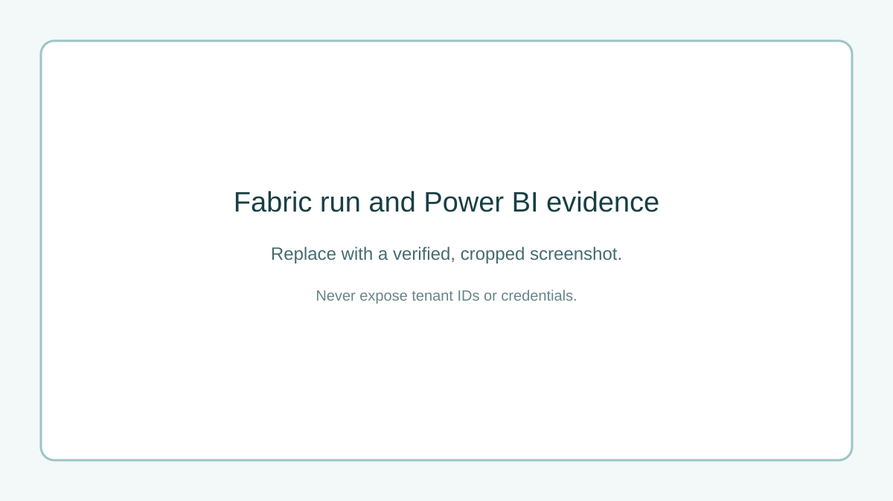

# NYC Mobility Analytics Engineering Platform

[](https://github.com/YOUR_USERNAME/nyc-mobility-analytics-engineering/actions/workflows/ci.yml)

A production-shaped mobility pipeline using Bronze/Silver/Gold modeling, explicit data-quality evidence, PySpark/Fabric implementation, dbt marts, automated tests, and a Power BI serving design.

> Portfolio status: local sample implementation included. Change this to `Fabric implementation complete` only after following `docs/fabric_build.md` in your own workspace.

## What this proves

- Reproducible ingestion and medallion-layer responsibilities.
- PySpark cleaning, deterministic keys, Delta tables, and persisted checks in Microsoft Fabric.
- dbt staging, incremental mart logic, schema tests, and lineage.
- Cloud-independent CI for linting, unit tests, local pipeline, and dbt build.
- Business-ready Power BI measures with a documented grain.

## Local build

```bash
python -m venv .venv
# Windows: .venv\Scripts\activate
# macOS/Linux: source .venv/bin/activate
pip install -r requirements.txt
pytest -q
python -m src.pipeline --sample
dbt build --profiles-dir .
```

This creates local Bronze, Silver, and Gold Parquet outputs, six persisted quality checks, and a DuckDB dbt warehouse. It allows reviewers to verify the logic without a Fabric account.

## Fabric build

Follow the [exact Fabric checklist](docs/fabric_build.md), then replace the placeholder below with your real screenshot.



## Architecture

See [architecture and design decisions](docs/architecture.md).

## Claims ledger - replace with actual evidence

| Claim | Evidence |
|---|---|
| Source and month | `[NYC TLC URL and YYYY-MM]` |
| Bronze rows | `[exact count]` |
| Silver valid unique trips | `[exact count]` |
| Gold rows and grain | `[count; date x pickup zone]` |
| Quality checks | `[passed / total]` |
| Pipeline run time | `[minutes/seconds]` |
| Rerun/idempotency result | `[exact observation]` |
| Failure-recovery test | `[failure injected and repair]` |
| dbt result | `[models/tests passed]` |

## Limitations

- The committed data is a tiny synthetic-style fixture for CI, not representative of NYC operations.
- Local pandas/DuckDB execution validates logic but is not a substitute for a Fabric integration run.
- A production platform needs incremental ingestion, late-arrival rules, observability alerts, access control, cost tests, and deployment environments.
- Taxi demand does not represent all mobility demand and can reflect geographic and service-access biases.

## Repository map

```text
src/                 local reproducible medallion pipeline
fabric/              paste-ready Fabric PySpark notebook source
models/              dbt staging and incremental mart
tests/               transformation and grain checks
docs/                architecture, Fabric, and Power BI instructions
.github/workflows/   automated local build and tests
```

## Author

Rishi Ratnakar - [LinkedIn](https://www.linkedin.com/in/YOUR_LINKEDIN_SLUG) | [GitHub](https://github.com/YOUR_USERNAME)

