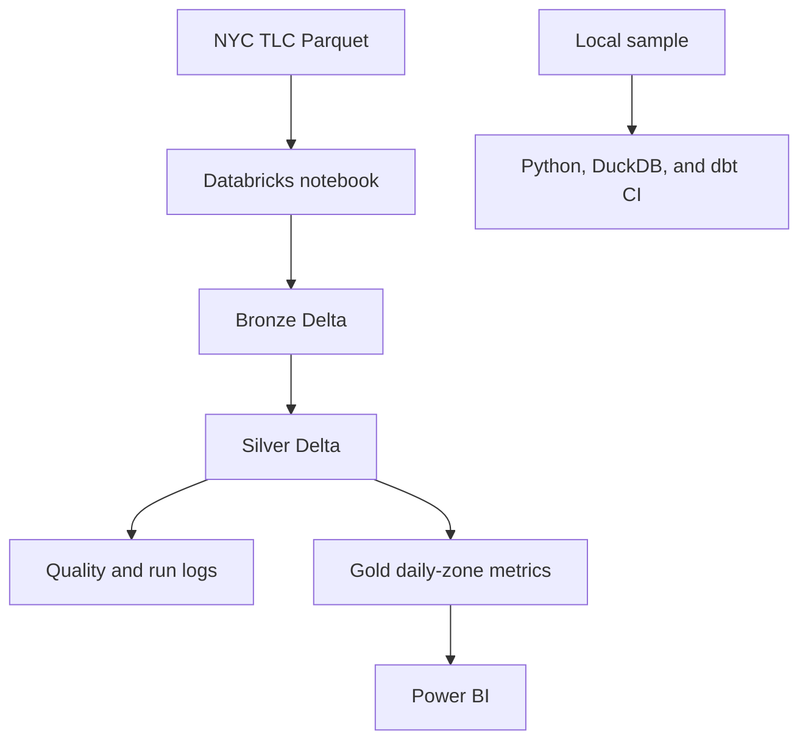

# Urban Mobility Analytics Engineering

[](https://github.com/RishiRatnakarData/urban-mobility-analytics-engineering/actions/workflows/ci.yml)

An end-to-end data engineering platform for NYC Yellow Taxi operations. It processes official TLC Parquet files through a Databricks Delta Lake medallion architecture, validates data quality, handles reruns and late-arriving data, models curated metrics with dbt, and presents results in a four-page Power BI report.


## Business problem

Raw taxi trip files contain millions of records and may arrive late, contain invalid values, or be processed more than once. This project converts those files into trusted daily pickup-zone metrics while preserving traceability and preventing duplicate business records.

It answers four engineering and analytical questions:

- Can monthly source files be ingested repeatedly without duplicating trips?
- Can invalid and duplicate records be removed before analytics?
- Can historical dates be refreshed when older data arrives after newer data?
- Can operations teams monitor demand, revenue, trip characteristics, and pipeline quality?

## Key results

- Processed **7,052,769 Bronze rows** across January and February 2025.
- Produced **6,560,019 validated Silver trips** and **13,884 Gold daily-zone rows**.
- Passed **8 of 8 Databricks data-quality checks**.
- Preserved **3,253,109 January** and **3,306,910 February** Silver rows after January arrived second.
- Refreshed **33 affected date partitions** during the late-arrival run.
- Verified same-file rerun behavior with unchanged business-table counts and passing uniqueness checks.
- Power BI reports **$138.81M revenue**, **$21.16 revenue per trip**, **5.68 average miles**, and **37.57% peak-period share**.

## Architecture



See [architecture and design decisions](docs/architecture.md) for layer grains and runtime boundaries.

## Technical implementation

- **Bronze:** preserves source fields and adds deterministic record IDs, source metadata, ingestion timestamps, and batch IDs.
- **Silver:** validates types and locations, removes invalid durations and distances, deduplicates trips, and derives reusable features.
- **Gold:** aggregates by pickup date and pickup zone for operational reporting.
- **Idempotency:** Delta `MERGE` prevents the same source records from duplicating Bronze and Silver data.
- **Late arrivals:** only dates touched by an incoming batch are rebuilt in Gold, including historical partitions.
- **Auditability:** data-quality results and pipeline-run summaries are stored as Delta tables.
- **dbt:** staging and incremental mart models reproduce the analytical contract locally with eight schema and grain tests.
- **Automation:** GitHub Actions runs Ruff, pytest, notebook compilation, the sample pipeline, and `dbt build`.

## Databricks execution

Authenticated execution on Databricks Free Edition was completed on September 10, 2026 UTC.

| Scenario | Bronze rows | Silver rows | Gold rows | Quality | Refreshed dates | Duration |
|---|---:|---:|---:|---:|---:|---:|
| February initial load | 3,577,543 | 3,306,910 | 6,668 | 8/8 | 30 | 86.66 s |
| February idempotent rerun | 3,577,543 | 3,306,910 | 6,668 | 8/8 | 30 | 163.55 s |
| Recovery after missing-source test | 3,577,543 | 3,306,910 | 6,668 | 8/8 | 30 | 149.60 s |
| January processed after February | 7,052,769 | 6,560,019 | 13,884 | 8/8 | 33 | 150.97 s |

The controlled failure used a nonexistent source path and raised `FileNotFoundError` before table writes. Restoring the correct path returned the pipeline to the verified February counts. Detailed execution notes are in [docs/databricks_execution.md](docs/databricks_execution.md).

## Power BI report

| Page | Purpose |
|---|---|
| [Operations Overview](docs/images/operations_overview.png) | Demand and revenue KPIs with daily trip volume |
| [Zone Performance](docs/images/zone_performance.png) | Top pickup zones by trips with comparative metrics |
| [Time Patterns](docs/images/time_patterns.png) | Daily demand and peak-period share |
| [Data Quality](docs/images/data_quality.png) | Latest pipeline checks and pass rate |

The semantic model and DAX measures are documented in [docs/power_bi.md](docs/power_bi.md).

## Run locally

### Windows PowerShell

```powershell
py -3.12 -m venv .venv
.\.venv\Scripts\Activate.ps1
python -m pip install --upgrade pip
pip install -r requirements.txt
python -m pytest -q
python -m src.pipeline --sample
dbt build --profiles-dir .
```

### macOS or Linux

```bash
python3.12 -m venv .venv
source .venv/bin/activate
python -m pip install --upgrade pip
pip install -r requirements.txt
python -m pytest -q
python -m src.pipeline --sample
dbt build --profiles-dir .
```

The sample pipeline writes Bronze, Silver, and Gold Parquet outputs, six quality results, and a JSON run summary. Generated outputs are ignored by Git.

## Testing and CI

- **3 Python tests** cover transformations, quality rules, and late-arrival upserts.
- **8 dbt tests** enforce required fields, uniqueness, and the daily-zone grain.
- The local sample produces **12 Bronze, 12 Silver, and 12 Gold rows** with **6 of 6 checks passing**.
- [GitHub Actions CI run 34505698381](https://github.com/RishiRatnakarData/urban-mobility-analytics-engineering/actions/runs/34505698381) completed successfully.
- CI is cloud-independent and does not require Databricks credentials.

## Repository structure

```text
databricks/          PySpark and Delta Lake source notebook
src/                 local medallion and late-arrival implementation
models/              dbt staging and incremental mart models
tests/               Python and dbt data tests
docs/                architecture, execution, and Power BI documentation
data/sample/         deterministic offline fixture for CI
.github/workflows/   continuous-integration workflow
```

## Limitations

- The local fixture validates behavior but is not representative of citywide traffic volume.
- The current cloud implementation processes NYC Yellow Taxi data rather than multiple cities or travel modes.
- The deterministic trip key could theoretically collide when distinct trips share every input field.
- A production deployment would require job orchestration, incremental file discovery, quarantine handling, alert delivery, access control, environment promotion, and cost monitoring.
- Taxi activity may reflect geographic and service-access biases.

## Technology

Databricks, PySpark, Delta Lake, Python, pandas, DuckDB, dbt, SQL, Parquet, Power BI, pytest, Ruff, GitHub Actions

## Data source

[NYC Taxi & Limousine Commission Trip Record Data](https://www.nyc.gov/site/tlc/about/tlc-trip-record-data.page)

## Author

Rishi Ratnakar | [LinkedIn](https://www.linkedin.com/in/rishi-ratnakar) | [GitHub](https://github.com/RishiRatnakarData)
