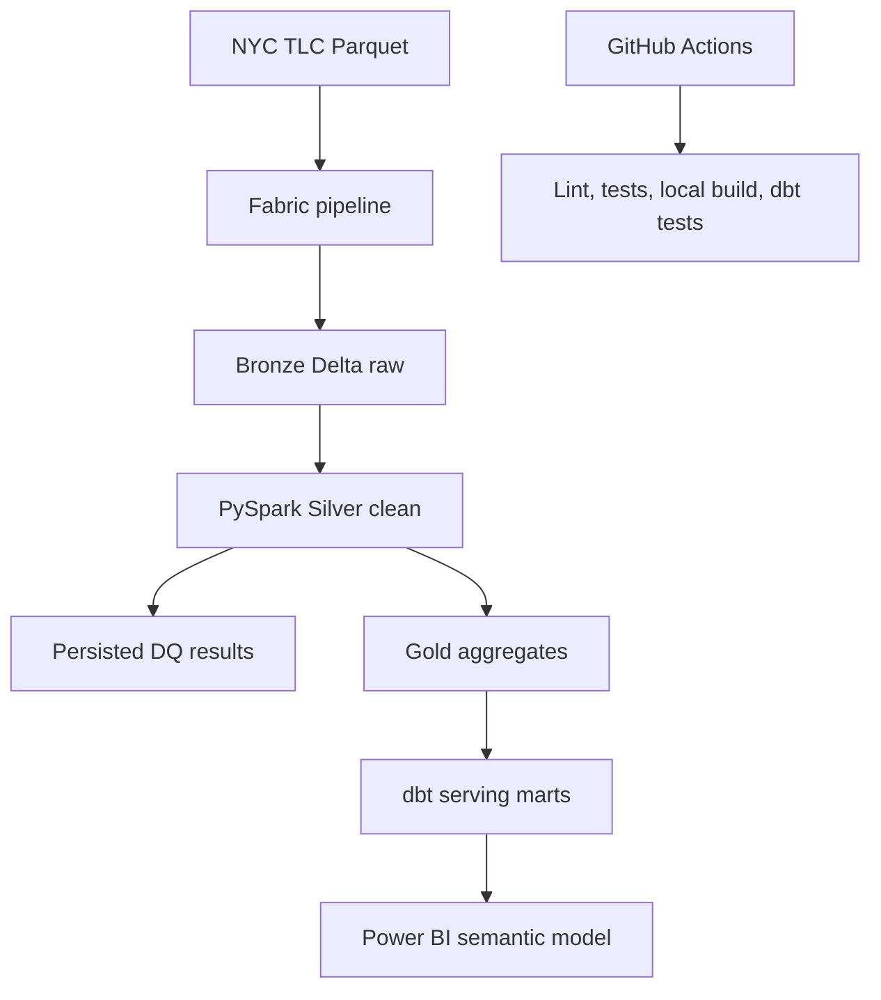

# Architecture

## Layer responsibilities

| Layer | Grain | Purpose |
|---|---|---|
| Bronze | Source row | Preserve source values and ingestion metadata |
| Silver | Valid unique trip | Type, deduplicate, validate, and derive reusable features |
| Gold | Date and pickup zone | Curated operational metrics for BI |
| dbt mart | Date and pickup zone | Tested analytics contract and incremental serving pattern |

## Engineering reasoning

- Separate raw, validated, and curated layers so failures are traceable.
- Use deterministic trip keys and overwrite sample mode for idempotency.
- Persist quality results rather than only printing them.
- Keep CI cloud-independent: it verifies transformations and dbt locally; Fabric integration still requires an authenticated workspace test.
- Use incremental dbt logic at the reporting mart boundary; production would use a watermark and merge strategy for late-arriving trips.

