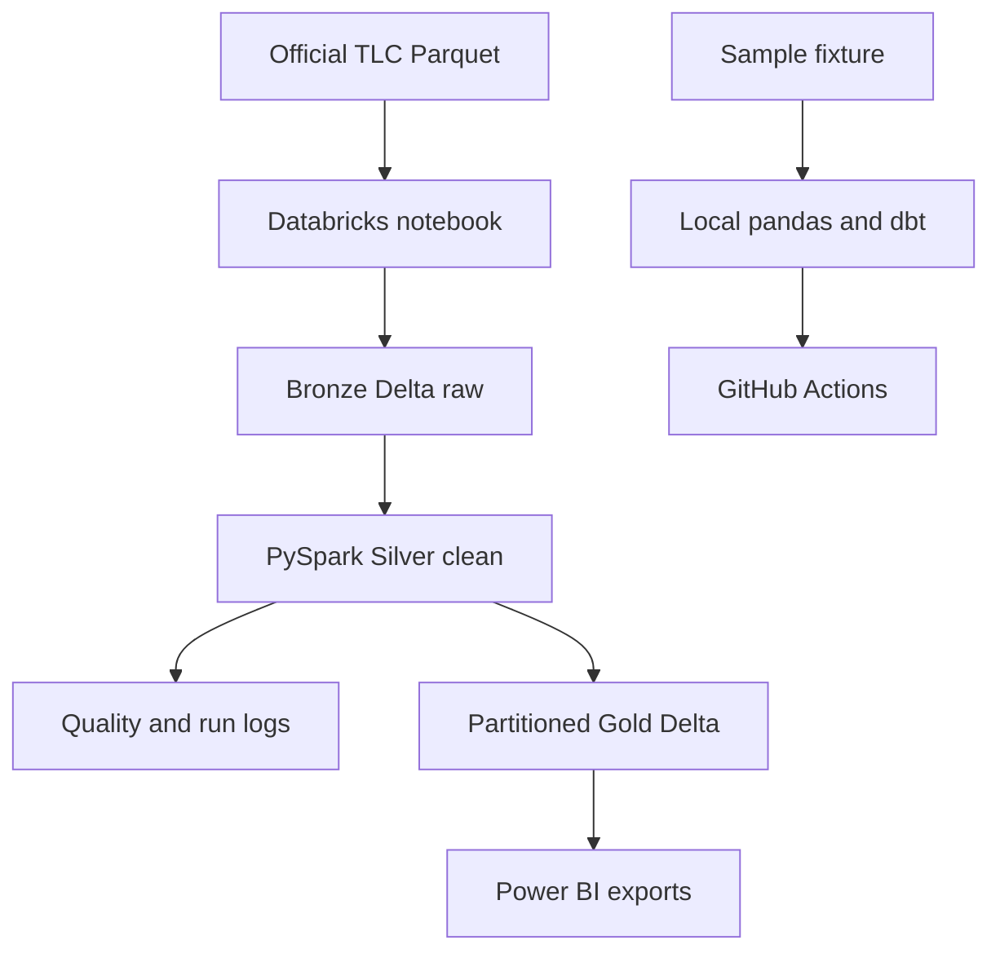

# Architecture

## Layer responsibilities

| Layer | Grain | Purpose |
|---|---|---|
| Bronze | Source row | Preserve source values and ingestion metadata |
| Silver | Valid unique trip | Type, deduplicate, validate, and derive reusable features |
| Gold | Date and pickup zone | Curated operational metrics for BI |
| Audit | Check or pipeline run | Persist pass/fail observations and run metadata |
| Local dbt mart | Date and pickup zone | Tested SQL contract and incremental serving pattern |

## Engineering reasoning

- Separate raw, validated, and curated layers so failures are traceable.
- Use deterministic hashes and Delta MERGE so repeated source batches do not duplicate business rows.
- Persist quality results rather than only printing them.
- Recompute only Gold dates touched by an incoming batch, allowing older trips to arrive after newer data.
- Keep CI cloud-independent: it verifies transformations, notebook syntax, and dbt locally; the Databricks runtime is validated separately.
- Export only the small Gold and quality tables to Power BI; raw trip data stays outside the BI layer.

## Execution boundaries

The Databricks and local paths implement the same layer responsibilities but use different runtimes.
Databricks runs the PySpark and Delta Lake implementation. pandas, Parquet, DuckDB, and dbt provide a
fast local implementation that runs in CI without cloud credentials.

