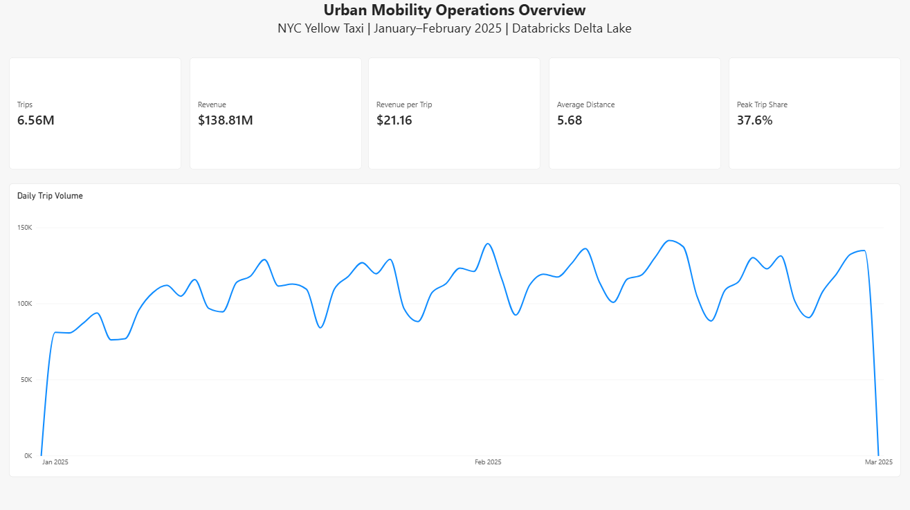
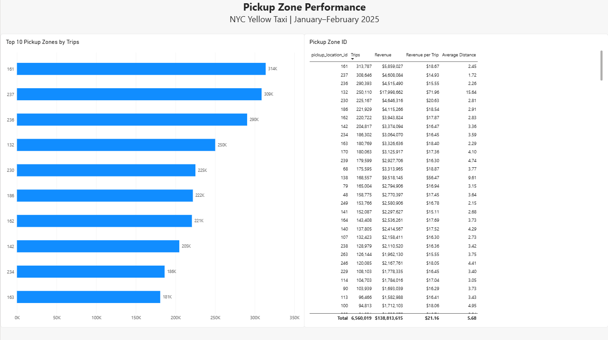
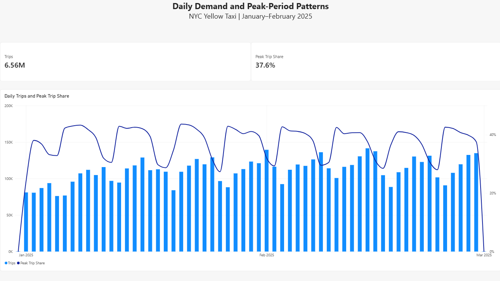
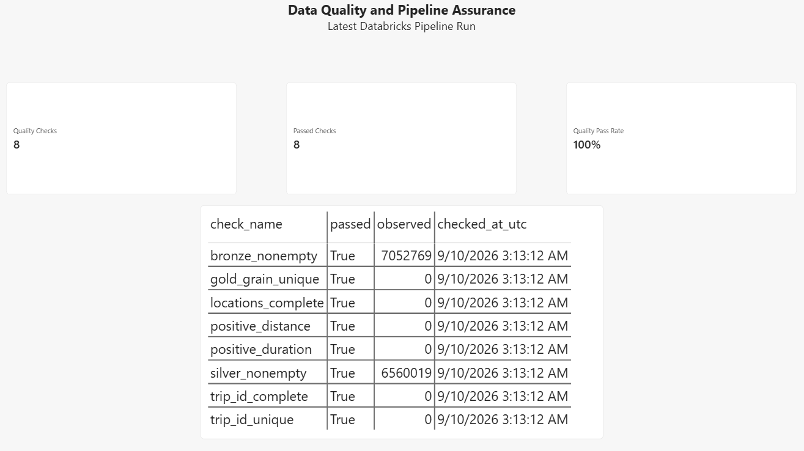

# Power BI report

The report uses curated Gold metrics and the latest persisted data-quality results. Trip-level Bronze and Silver data remain outside the BI model.

## Data model

| Table | Grain | Use |
|---|---|---|
| `GoldDailyZoneMetrics` | Pickup date and pickup zone | Operations, zone, and time analysis |
| `DataQualityResults` | Pipeline run and check | Quality status and diagnostic detail |

No relationship is required between the two imported tables because the data-quality page summarizes the latest pipeline run independently of the operational metrics.

## Measures

```DAX
Trips =
SUM ( GoldDailyZoneMetrics[trip_count] )

Revenue =
SUM ( GoldDailyZoneMetrics[total_revenue] )

Revenue per Trip =
DIVIDE ( [Revenue], [Trips] )

Average Distance =
DIVIDE (
    SUMX (
        GoldDailyZoneMetrics,
        GoldDailyZoneMetrics[avg_distance] * GoldDailyZoneMetrics[trip_count]
    ),
    [Trips]
)

Peak Trip Share =
DIVIDE (
    SUMX (
        GoldDailyZoneMetrics,
        GoldDailyZoneMetrics[peak_trip_share] * GoldDailyZoneMetrics[trip_count]
    ),
    [Trips]
)

Quality Checks =
COUNTROWS ( DataQualityResults )

Passed Checks =
CALCULATE (
    COUNTROWS ( DataQualityResults ),
    DataQualityResults[passed] = TRUE ()
)

Quality Pass Rate =
DIVIDE ( [Passed Checks], [Quality Checks] )
```

Weighted measures are used for average distance and peak-trip share so aggregate cards remain correct across dates and zones.

## Report pages

### Operations Overview



- Cards: Trips, Revenue, Revenue per Trip, Average Distance, Peak Trip Share
- Daily trip-volume line chart
- Reporting-period context for January and February 2025

### Zone Performance



- Top 10 pickup zones by Trips
- Comparison table for Trips, Revenue, Revenue per Trip, and Average Distance
- Descending trip-volume sort

### Time Patterns



- Daily Trips as columns
- Peak Trip Share as a secondary-axis line
- Summary cards for total Trips and Peak Trip Share

### Data Quality



- Cards: Quality Checks, Passed Checks, Quality Pass Rate
- Detail table with check name, pass status, observed value, and check timestamp

## Validated totals

| Metric | Result |
|---|---:|
| Trips | 6,560,019 |
| Revenue | $138,813,614.92 |
| Revenue per trip | $21.16 |
| Average distance | 5.68 miles |
| Peak-period share | 37.57% |
| Latest quality checks | 8/8 passed |
